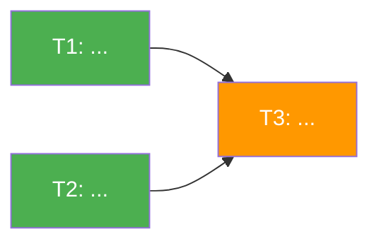

# ADR-NNN: Title

<!-- ADR = technical decisions (how & why). For product specs, use prd/TEMPLATE.md -->

## Status

Proposed | Accepted | Superseded by [ADR-XXX](XXX-title.md) | Deprecated

## Date

YYYY-MM-DD

## Context

<!-- Lead with NUMBERS: how many users/records/% affected, current vs desired state. -->
<!-- Show a "current gaps" table if multiple segments are affected. -->

### Forces

- **Business**: Why does this matter for revenue, growth, or users?
- **Technical**: What existing infrastructure, APIs, or patterns are relevant?
- **UX**: How does this affect user experience? What frontend/mobile changes (if any)?
- **Data**: What data exists today? What's missing? What volumes are we dealing with?

### Relationship to other ADRs

<!-- Optional. Remove if standalone. -->

- Builds on / depends on [ADR-NNN](NNN-title.md): how
- Supersedes [ADR-NNN](NNN-title.md): why

### ClickUp Tasks

<!-- Optional. Link motivating tasks/requests that led to this ADR. -->

- [task-id](https://app.clickup.com/t/task-id): description

---

## Decision

<!-- Number each decision. For each one include: -->
<!-- - What changes and why -->
<!-- - Concrete file paths and line numbers where changes happen -->
<!-- - Code examples: function signatures, API payloads, SQL schemas, data flow diagrams -->
<!-- - Error handling strategy: propagate / fire-and-forget / retry -->
<!-- - "Do NOT" callouts: things that look like they should be done but shouldn't -->
<!-- - If this modifies a prior ADR, add a "Changes to ADR-NNN" section with before/after code -->

<!-- API & DATA COMPATIBILITY (required for any API or schema change): -->
<!-- - Mobile backward compat: compare the EXACT response shape against the Dart/Flutter -->
<!--   model in Muso-Android (freezed classes + generated .g.dart fromJson). Non-nullable -->
<!--   Dart fields (String, int, double) CRASH on null — use '' or 0 fallbacks, not null. -->
<!-- - Previously stored data: new fields won't exist on old records. The DTO mapper must -->
<!--   handle missing data gracefully (defaults/fallbacks), not just new happy-path data. -->
<!-- - New associations (eager loads, FKs): verify existing records have the FK populated. -->
<!--   If not, either backfill or handle null in the read path. -->
<!-- - Add a "Response shape" code block showing the full JSON payload with types, so -->
<!--   reviewers can diff it against the mobile model. -->

### 1. {Decision title}

...

### 2. {Decision title}

...

---

## Consequences

### Positive

- ...

### Negative

- ...

### Risks

- ...

---

## Open Questions

<!-- Optional. Remove if everything is resolved. -->
<!-- Items that need research, data analysis, or team input before implementation. -->

1. **[ ] {Question}** — context, what needs to happen to answer it

---

## Implementation Tasks

<!-- Mermaid dependency graph + summary table. -->
<!-- This is the canonical task list — the implementation plan references these, not the other way around. -->

Green = no deps (parallel). Blue = blocked by green. Orange = blocked by all.

| ID  | Task         | Depends On | Decisions | ClickUp | Key Files       |
| --- | ------------ | ---------- | --------- | ------- | --------------- |
| T1  | {title}      | —          | D1        |         | {list of files} |
| T2  | {title}      | —          | D2        |         | {list of files} |
| T3  | {title}      | T1, T2     | D1, D2    |         | {list of files} |

---

## Verification

### Cross-cutting invariants
<!-- Keep these standard invariants and add task-specific ones below: -->
- If any API response shape changed: verified field-by-field against Muso-Android Dart model (non-nullable fields never receive null)
- If any API response shape changed: old records (created before this change) still serialize correctly with safe defaults
- {Add task-specific invariants here}

### T1: {Task title}
- [ ] {Acceptance criterion}

### T2: {Task title}
- [ ] {Acceptance criterion}

---

## Affected Repos

- **repo-name**: what changes and which tasks
