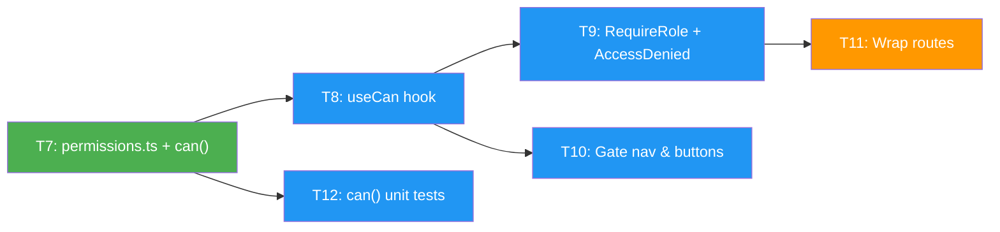

# Frontend Capabilities via `/users/me` and `can()` Helper

## Status

Proposed

## Date

2026-05-19

## Context

The assignment requires the React/TypeScript frontend to:

- Hide navigation links and buttons the current user cannot access.
- Show a friendly "Access Denied" page on direct navigation to unauthorized routes (no blank screens, no cryptic errors).

The template already calls `GET /users/me` on app boot via the `useAuth` hook and gates a handful of UI areas on `currentUser.is_superuser`. With three roles introduced by [[rbac-fastapi-dependencies]], the gating logic must generalize without growing into ad-hoc role comparisons scattered across components.

**The backend is the security boundary** (enforced by `require_roles(...)` per [[rbac-fastapi-dependencies]]); frontend gating is **UX only**. A user who bypasses frontend checks still hits a backend `403`.

### Forces

- **UX**: README explicitly forbids silent failure or cryptic errors. The unauthorized state must be a real screen with explanatory copy.
- **Technical**: The template uses TanStack Query plus a generated OpenAPI client. Adding `role` to `UserPublic` (per [[rbac-fastapi-dependencies]]) propagates to the client types automatically — no manual type maintenance.
- **Maintainability**: The permission matrix already exists conceptually in [[rbac-fastapi-dependencies]]; the frontend must reflect it from a single TS source rather than peppering `role === "admin"` checks through JSX.

### Relationship to other ADRs

- Depends on [[rbac-fastapi-dependencies]]: the `role` field on `UserPublic` and the canonical permission matrix originate there.
- Scope boundary: existing `is_superuser`-gated UI surfaces (`AppSidebar.tsx`, `Admin/columns.tsx`, `Admin/EditUser.tsx`, `Admin/AddUser.tsx`, `routes/_layout/settings.tsx`, `routes/_layout/admin.tsx`) are **not** migrated here. They continue to read `currentUser.is_superuser` and are converted to `can()` in [[deprecate-is-superuser]]. This ADR adds `can()`-based gating only for **new** surfaces introduced by the RBAC work (metrics route, manager-accessible user list view, the `<RequireRole>` wrappers on routes added in scope).

---

## Decision

### 1. `role` field reaches the frontend via the existing `/users/me` round-trip

No new endpoint, no JWT decoding on the client. `GET /users/me` already returns `UserPublic`; once [[rbac-fastapi-dependencies]] adds `role` to `UserPublic`, the OpenAPI-generated client surfaces it automatically. The `useAuth` hook exposes `currentUser.role`.

**Do NOT** decode the JWT on the client to read the role — token format is a backend concern and would couple the frontend to a private contract.

### 2. Permission matrix as a single TS module

`frontend/src/auth/permissions.ts`:

```ts
import type { Role } from "@/client";

export type Action =
  | "users.list"
  | "users.create"
  | "users.update_any"
  | "metrics.view"
  | "profile.update_own";

const MATRIX: Record<Action, Role[]> = {
  "users.list":         ["admin", "manager"],
  "users.create":       ["admin"],
  "users.update_any":   ["admin"],
  "metrics.view":       ["admin", "manager"],
  "profile.update_own": ["admin", "manager", "member"],
};

export const can = (action: Action, role: Role | undefined): boolean =>
  !!role && MATRIX[action].includes(role);
```

`can()` is pure, trivially unit-testable, and the matrix lives in **one** file. The README "Permission Matrix" section cites both this file and the backend `require_roles(...)` arguments as the canonical pair.

### 3. `useCan(action)` hook and `<RequireRole>` route guard

- `useCan(action)` wraps `can(action, currentUser.role)` from `useAuth`. Components gate JSX with `useCan("users.list") && <Link …/>`.
- `<RequireRole action="users.list">` is a route-level wrapper used in the TanStack Router config. On `false`, it renders `<AccessDenied>` instead of the route content — **not** a redirect, so the URL stays meaningful and the user understands what was forbidden.

### 4. `<AccessDenied>` component

A first-class screen co-located with existing error/empty-state components. Copy: "You don't have access to this page. Contact an admin if you think this is a mistake." with a "Back to dashboard" link. Used everywhere the frontend gates a route — never inline `alert()` or a toast.

---

## Consequences

### Positive

- `can()` is a pure function — testable without React, without a router, without auth state.
- Adding a new gated action = one line in `MATRIX` plus the corresponding backend `require_roles(...)` call.
- Single `/users/me` round-trip already in flight on boot; zero added network cost.
- URL stays meaningful on forbidden navigation, aiding both UX and bug reports ("I clicked this link and got Access Denied").

### Negative

- Permission matrix is **duplicated** (backend `require_roles(...)` arguments + frontend `MATRIX`). For 3 roles × 5 actions, this is acceptable; the README calls out the duplication explicitly so reviewers don't miss it.
- Role changes are not real-time: the user must log out/in (or trigger a `/users/me` refetch) to see new capabilities. Acceptable for this surface.

### Risks

- Drift between backend and frontend matrices. Mitigation: README's permission matrix table is the single canonical doc; both files are linked from it. A future enhancement could generate `MATRIX` from a shared JSON or from the OpenAPI extensions, but YAGNI for this scope.

---

## Open Questions

1. **[ ] Exact placement of `<RequireRole>` in the TanStack Router tree** — depends on existing route file layout; trivial decision deferred to implementation.

---

## Implementation Tasks



Green = no deps. Blue = depends on T7. Orange = blocked by T9.

| ID  | Task | Depends On | Decisions | Key Files |
| --- | ---- | ---------- | --------- | --------- |
| T7  | Permission map + `can()` helper | ADR-025 T1 | D2 | `frontend/src/auth/permissions.ts` |
| T8  | `useCan(action)` hook | T7 | D3 | `frontend/src/auth/useCan.ts` |
| T9  | `<RequireRole>` route guard + `<AccessDenied>` screen | T8 | D3, D4 | `frontend/src/auth/RequireRole.tsx`, `frontend/src/components/AccessDenied.tsx` |
| T10 | Conditionally render nav links and action buttons | T8 | D3 | existing layout/nav components |
| T11 | Wrap protected routes in the router with `<RequireRole>` | T9 | D3 | TanStack Router config |
| T12 | Unit tests for `can()` covering every matrix row | T7 | D2 | `frontend/src/auth/permissions.test.ts` |

---

## Verification

### Cross-cutting invariants

- No raw `currentUser.role === "..."` comparisons in **new** components introduced by this ADR — all gating routes through `can()` / `useCan()`.
- Existing `is_superuser` references are unchanged (their migration is [[deprecate-is-superuser]]).
- `<AccessDenied>` is the only unauthorized-state UI; no blank pages, redirects, or generic toasts for known-forbidden routes added in scope.
- The frontend `MATRIX` matches the README permission table row-for-row.

### T7: `can()`
- [ ] `can(action, undefined)` returns `false`
- [ ] `can("users.list", "member")` → `false`; `can("users.list", "manager")` → `true`

### T9: Route guard
- [ ] Direct navigation to a forbidden route renders `<AccessDenied>` (URL preserved); no redirect

### T10: Nav gating
- [ ] No nav link or action button rendered for an action the current role lacks

### T12: Tests
- [ ] One test per matrix row asserting allowed and denied roles

---

## Affected Repos

- **Fullstack-Dev-Test-Task** (this repo): T7–T12.
