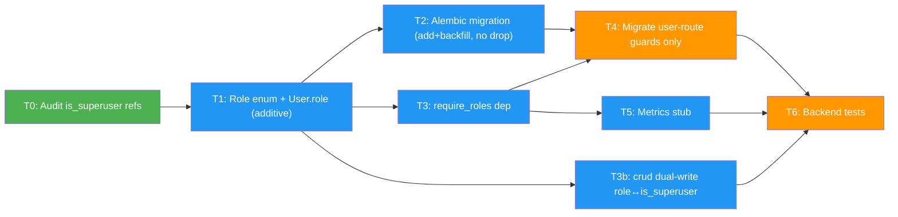

# Role-Based Authorization via FastAPI Dependencies

## Status

Proposed

## Date

2026-05-19

## Context

The Full-Stack FastAPI Template distinguishes only two authorization tiers today: authenticated user and superuser, gated by the boolean `User.is_superuser` column and the `get_current_active_superuser` FastAPI dependency. The Fullstack-Dev-Test-Task assignment requires three mutually-exclusive roles (`admin`, `manager`, `member`) and the following permission matrix:

| Action | admin | manager | member |
|--------|-------|---------|--------|
| List all users | ✓ | ✓ | ✗ |
| Create user | ✓ | ✗ | ✗ |
| View metrics | ✓ | ✓ | ✗ |
| Update own profile | ✓ | ✓ | ✓ |
| Update any profile | ✓ | ✗ | ✗ |

Of the protected surface above, every user-related endpoint already exists in `backend/app/api/routes/users.py`. The **metrics endpoint does not exist** and must be added as a stub.

`is_superuser` has **13 production consumers** across backend and frontend (see audit task T0). To keep the blast radius of this change small, **this ADR is additive only**: `User.role` is introduced alongside `is_superuser`, and the new `require_roles(...)` dependency reads `role`. `is_superuser` and its existing consumers are left untouched. Removal is deferred to a follow-up ADR once every consumer has been migrated to `role` and the inventory in T0 has shrunk to zero.

### Forces

- **Business**: Assignment scoring weights "consistent enforcement" and "easy to extend" — adding a new role must not require touching 10+ files.
- **Technical**: Template already uses FastAPI `Annotated[..., Depends(...)]` aliases (`SessionDep`, `CurrentUser`). Roles must integrate with this idiom rather than inventing a parallel abstraction.
- **UX**: Backend must return `403 Forbidden` for role mismatch, distinct from `401 Unauthorized` for missing/invalid tokens, so the frontend can route each to the correct UX state.
- **Data**: Tiny dataset (dev seed + initial superuser); migration cost is negligible.

### Relationship to other ADRs

- Companion to [[frontend-capabilities-can-helper]] which specifies how the frontend consumes the role exposed by this ADR.
- Predecessor to [[deprecate-is-superuser]] (future, not yet written) which will migrate the remaining `is_superuser` consumers and drop the column.

---

## Decision

### 1. Introduce `Role` enum and `User.role` column (additive)

In `backend/app/models.py`:

```python
class Role(str, Enum):
    ADMIN = "admin"
    MANAGER = "manager"
    MEMBER = "member"

class UserBase(SQLModel):
    email: EmailStr
    is_active: bool = True
    is_superuser: bool = False  # kept; deprecated in a follow-up ADR
    role: Role = Field(default=Role.MEMBER)
    full_name: str | None = None
```

`is_superuser` **stays**. An Alembic migration adds the `role` column and backfills it: `is_superuser=True → 'admin'`, `False → 'member'`. The column is not dropped.

Dual-truth is contained by writing both fields in `crud.create_user` and `crud.update_user` (e.g., `is_superuser = (role == Role.ADMIN)`), so existing `is_superuser` consumers see consistent values during the transition. Reads in new code use `role`; reads in pre-existing code keep using `is_superuser` until [[deprecate-is-superuser]] migrates them.

### 2. `require_roles(*roles)` dependency factory

In `backend/app/api/deps.py`:

```python
def require_roles(*allowed: Role):
    def _check(current_user: CurrentUser) -> User:
        if current_user.role not in allowed:
            raise HTTPException(status_code=403, detail="Forbidden")
        return current_user
    return _check
```

Replaces `get_current_active_superuser`. Usage at the route level:

```python
@router.get("/", dependencies=[Depends(require_roles(Role.ADMIN, Role.MANAGER))])
def read_users(...): ...
```

**Do NOT** scatter role checks inside route bodies — enforcement must remain declarative at the dependency boundary so `rg "require_roles"` enumerates every gated route.

### 3. Add metrics stub endpoint

New `backend/app/api/routes/metrics.py` exposing `GET /metrics/` returning a fixed payload (e.g., `{"users_total": ..., "active_today": ...}`), gated on `require_roles(Role.ADMIN, Role.MANAGER)`. Wired into `backend/app/api/main.py`.

### 4. Re-gate existing routes per the matrix

| Route | Old guard | New guard |
|-------|-----------|-----------|
| `GET /users/` | `get_current_active_superuser` | `require_roles(ADMIN, MANAGER)` |
| `POST /users/` | `get_current_active_superuser` | `require_roles(ADMIN)` |
| `PATCH /users/{id}` | superuser inline | `require_roles(ADMIN)` |
| `DELETE /users/{id}` | `get_current_active_superuser` | `require_roles(ADMIN)` |
| `GET/PATCH /users/me` | `CurrentUser` only | unchanged |

`get_current_active_superuser` itself stays in `deps.py` for now (the `items.py` routes still reference `is_superuser` inline and are out of scope here). It is marked deprecated in a docstring and removed in [[deprecate-is-superuser]].

### 5. Audit `is_superuser` consumers (groundwork for the deprecate-is-superuser ADR)

As part of this ADR, produce a checked-in inventory of every `is_superuser` reference in production code so the follow-up removal ADR starts with a complete list rather than a fresh grep. Initial scan (see task T0):

- **Backend (5 files, 9 refs)**: `models.py`, `core/db.py`, `api/deps.py` (`get_current_active_superuser`), `api/routes/users.py` (lines 137, 172), `api/routes/items.py` (lines 21, 56, 89, 109).
- **Frontend (6 files, ~10 refs)**: `Sidebar/AppSidebar.tsx`, `Admin/columns.tsx`, `Admin/EditUser.tsx`, `Admin/AddUser.tsx`, `routes/_layout/settings.tsx`, `routes/_layout/admin.tsx`.

The inventory lives in the follow-up ADR's Context section.

---

## Consequences

### Positive

- Adding a new role = add an enum value + reference it in `require_roles(...)`. No route surgery, no scattered conditionals.
- `403` vs `401` distinction is uniform (raised by the dependency, handled by FastAPI's default exception path).
- Enforcement is greppable: every protected route is visible in a single `rg "require_roles"`.
- **Small blast radius**: zero existing `is_superuser` consumers are touched. The 13 audited references continue to work unchanged. Risk of regressions in `items.py` ownership checks, the admin UI, sidebar gating, and settings tabs is held at zero.

### Negative

- One role per user. If the product later needs composite roles ("manager + auditor"), a many-to-many refactor is required.
- **Dual-truth window**: `is_superuser` and `role` both encode "is this user an admin?" until [[deprecate-is-superuser]] lands. Drift is prevented by writing both in `crud.create_user`/`update_user`, but contributors must remember this until the removal ADR ships.

### Risks

- Backfill mis-mapping on existing databases. Mitigation: migration is idempotent, includes a backfill verification query, and is gated by a Pytest fixture-level smoke test.
- A contributor sets `role` without `is_superuser` (or vice versa) through a direct DB write or a future endpoint. Mitigation: dual-write is centralized in `crud.py`; tests assert the two stay aligned.

---

## Open Questions

1. **[ ] Should self-signup (`POST /users/signup`) default to `member`?** — Safe default; confirmed unless product wants signup disabled entirely.

---

## Implementation Tasks



Green = no deps. Blue = blocked by green. Orange = blocked by all upstream.

| ID  | Task | Depends On | Decisions | Key Files |
| --- | ---- | ---------- | --------- | --------- |
| T0  | Audit and check in the full `is_superuser` consumer inventory (grounds [[deprecate-is-superuser]]) | — | D5 | inventory captured in [[deprecate-is-superuser]] Context |
| T1  | Add `Role` enum and `User.role` column **alongside** `is_superuser` (do not remove) | T0 | D1 | `backend/app/models.py` |
| T2  | Alembic migration: add `role`, backfill from `is_superuser`; **no drop** | T1 | D1 | `backend/app/alembic/versions/*.py` |
| T3  | `require_roles(*roles)` dependency factory; mark `get_current_active_superuser` deprecated (keep) | T1 | D2 | `backend/app/api/deps.py` |
| T3b | `crud.create_user` and `crud.update_user` write both fields in lockstep (`is_superuser = (role == ADMIN)`) | T1 | D1 | `backend/app/crud.py` |
| T4  | Swap guards on user routes per matrix (do **not** touch `items.py`, sidebar, admin UI) | T2, T3 | D2, D4 | `backend/app/api/routes/users.py` |
| T5  | `GET /metrics/` stub endpoint | T3 | D3 | `backend/app/api/routes/metrics.py`, `api/main.py` |
| T6  | Authorization tests: allowed + denied per matrix row, plus a "dual-truth alignment" test | T4, T5, T3b | D1, D2, D3, D4 | `backend/app/tests/api/routes/test_users.py`, `test_metrics.py`, `tests/crud/test_user.py` |

---

## Verification

### Cross-cutting invariants

- `is_superuser` consumer count is **unchanged** by this ADR (still ~13 production refs). The audit inventory in T0 matches the post-merge grep.
- New code paths (`require_roles`, metrics route, user routes for the matrix) reference `role`, never `is_superuser`.
- Every user-route from the matrix is `require_roles`-gated at the dependency level — no inline role checks in route bodies.
- `403` returned for role mismatch; `401` returned for missing/invalid token. Error body matches existing template shape.
- Seed (`init_db`) creates at least one user per role (`admin@example.com`, `manager@example.com`, `member@example.com`) with `is_superuser` set consistently via the dual-write path.

### T0: Audit
- [ ] Inventory captured in [[deprecate-is-superuser]] Context lists every production `is_superuser` reference with file + line

### T1: Role enum + column
- [ ] `Role` enum defined with `admin | manager | member`
- [ ] `User.role` non-nullable with default `member`
- [ ] `is_superuser` column **still present**

### T2: Migration
- [ ] Upgrades and downgrades cleanly on a fresh DB
- [ ] Existing `is_superuser=True` users land on `role='admin'`; others on `role='member'`
- [ ] `is_superuser` column is **not** dropped

### T3b: Dual-write
- [ ] Creating a user with `role=admin` sets `is_superuser=True`
- [ ] Updating a user's role to/from admin updates `is_superuser` in lockstep
- [ ] A unit test fails if the two ever diverge

### T4: Route guard migration
- [ ] User-routes from the matrix call `require_roles(...)` at the dependency level
- [ ] `items.py` is **not** modified (out of scope; addressed in [[deprecate-is-superuser]])
- [ ] `get_current_active_superuser` is still importable (marked deprecated)

### T6: Tests
- [ ] One allowed + one denied test per matrix row × role
- [ ] Test asserts `403` body, not just status code
- [ ] Dual-truth alignment test passes

---

## Affected Repos

- **Fullstack-Dev-Test-Task** (this repo): all changes; T1–T6.
